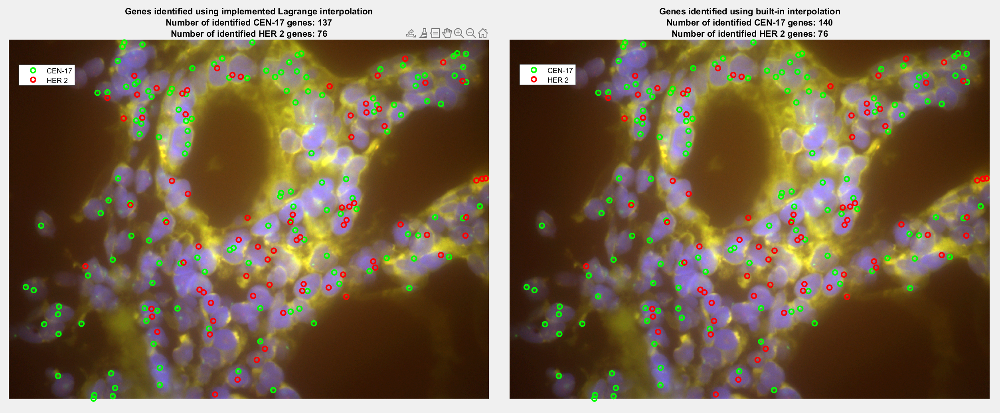
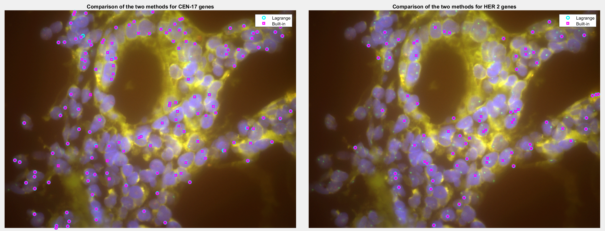

## Interpolation Based Gene Detection  
The project was created for the Numerical Methods course at my University.  
**The goal** of the task was to create a program in MATLAB that automatically detects genes in fluorescence in situ hybridization (FISH) microscopic images by identifying specific fluorescent spots corresponding to HER 2 (red) and CEN-17 (green) genes using interpolation methods. The task also involved comparing the implemented Lagrange interpolation method with the built-in interp1 interpolation method.  

To complete the task, it was necessary to load the image, select a characteristic fluorescent point, and perform interpolation based on its neighborhood. Then, it was required to compare the expected function values with the actual values across the entire image and use this information to highlight the fluorescent spots.

### Technologies
* Matlab
  
### Features
* Interpolate the fluorescent function using Lagrange interpolation
* Analyse the image and save fluorescent spots to the file
* Mark the fluorescent spots on the original image
* Compare the results for two methods of interpolation

### Setup and usage
After downloading the repository one should simply run it in Matlab. It is possible to play with the hyperparameters

### Sample Results
The results are presented on the figures below:  
  
  